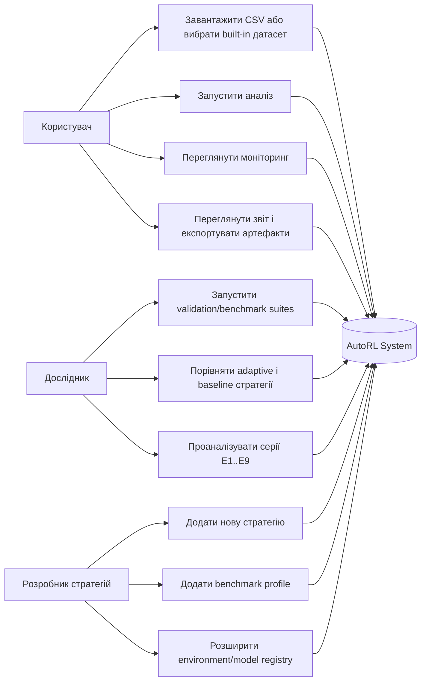

# DOC-01 Use Case Diagram

```mermaid
flowchart LR
    user[Користувач] --> uc1[Завантажити CSV або вибрати built-in датасет]
    user --> uc2[Запустити аналіз]
    user --> uc3[Переглянути моніторинг]
    user --> uc4[Переглянути звіт і експортувати артефакти]

    researcher[Дослідник] --> uc5[Запустити validation/benchmark suites]
    researcher --> uc6[Порівняти adaptive і baseline стратегії]
    researcher --> uc7[Проаналізувати серії E1..E9]

    developer[Розробник стратегій] --> uc8[Додати нову стратегію]
    developer --> uc9[Додати benchmark profile]
    developer --> uc10[Розширити environment/model registry]

    uc1 --> system[(AutoRL System)]
    uc2 --> system
    uc3 --> system
    uc4 --> system
    uc5 --> system
    uc6 --> system
    uc7 --> system
    uc8 --> system
    uc9 --> system
    uc10 --> system
```

Покриває ролі:
- користувач продуктового інтерфейсу;
- дослідник, який виконує експериментальні серії;
- розробник, який розширює систему.
