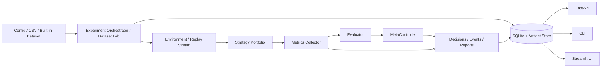

# DOC-02 DFD Level 0

Основний потік:
- конфігурація або дані подаються в application layer;
- runtime збирає метрики;
- evaluator і metacontroller формують рішення;
- результати зберігаються в SQLite та файлових артефактах;
- CLI/API/UI читають один і той самий persisted state.
