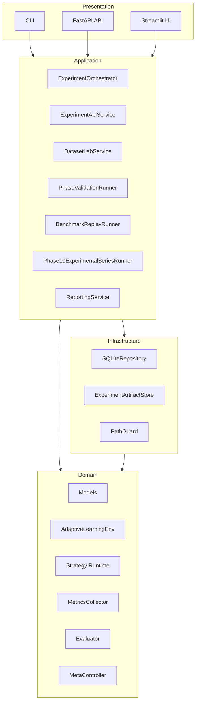

# DOC-03 Component Diagram

```mermaid
flowchart TB
    subgraph Presentation
        CLI[CLI]
        API[FastAPI API]
        UI[Streamlit UI]
    end

    subgraph Application
        Orchestrator[ExperimentOrchestrator]
        ApiService[ExperimentApiService]
        DatasetLab[DatasetLabService]
        Validation[PhaseValidationRunner]
        Benchmarks[BenchmarkReplayRunner]
        Phase10[Phase10ExperimentalSeriesRunner]
        Reporting[ReportingService]
    end

    subgraph Domain
        Models[Models]
        Env[AdaptiveLearningEnv]
        Runtime[Strategy Runtime]
        Metrics[MetricsCollector]
        Eval[Evaluator]
        Meta[MetaController]
    end

    subgraph Infrastructure
        Repo[SQLiteRepository]
        Artifacts[ExperimentArtifactStore]
        Guard[PathGuard]
    end

    CLI --> Application
    API --> Application
    UI --> Application
    Application --> Domain
    Application --> Infrastructure
    Infrastructure --> Domain
```

Ключова властивість:
- presentation layer не містить domain logic;
- application services є спільним входом для CLI/API/UI.
