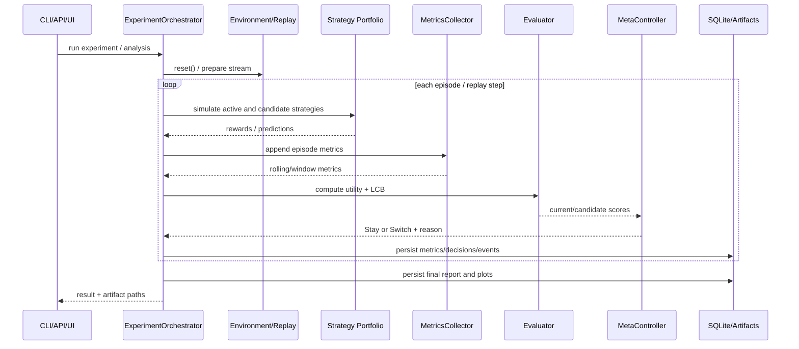

# DOC-04 Sequence Diagram Stay/Switch

```mermaid
sequenceDiagram
    participant Caller as CLI/API/UI
    participant Orch as ExperimentOrchestrator
    participant Env as Environment/Replay
    participant Strat as Strategy Portfolio
    participant Metrics as MetricsCollector
    participant Eval as Evaluator
    participant Meta as MetaController
    participant Repo as SQLite/Artifacts

    Caller->>Orch: run experiment / analysis
    Orch->>Env: reset() / prepare stream
    loop each episode / replay step
        Orch->>Strat: simulate active and candidate strategies
        Strat-->>Orch: rewards / predictions
        Orch->>Metrics: append episode metrics
        Metrics-->>Orch: rolling/window metrics
        Orch->>Eval: compute utility + LCB
        Eval-->>Meta: current/candidate scores
        Meta-->>Orch: Stay or Switch + reason
        Orch->>Repo: persist metrics/decisions/events
    end
    Orch->>Repo: persist final report and plots
    Orch-->>Caller: result + artifact paths
```
