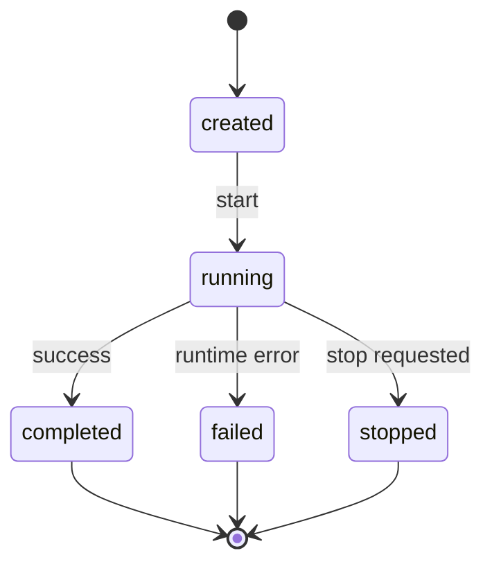

# DOC-05 State Machine Diagram

```mermaid
stateDiagram-v2
    [*] --> created
    created --> running: start
    running --> completed: success
    running --> failed: runtime error
    running --> stopped: stop requested
    completed --> [*]
    failed --> [*]
    stopped --> [*]
```

Persisted lifecycle values:
- `created`
- `running`
- `stopped`
- `completed`
- `failed`
