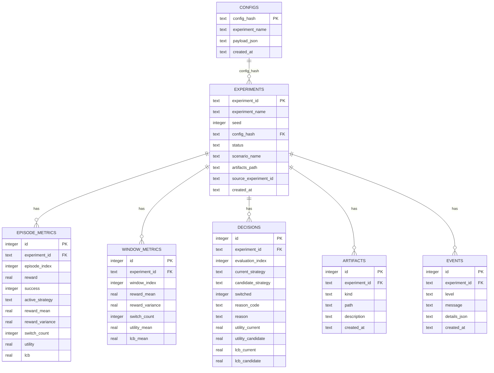

# DOC-06 ER Diagram / SQL Schema

```mermaid
erDiagram
    EXPERIMENTS ||--o{ EPISODE_METRICS : has
    EXPERIMENTS ||--o{ WINDOW_METRICS : has
    EXPERIMENTS ||--o{ DECISIONS : has
    EXPERIMENTS ||--o{ ARTIFACTS : has
    EXPERIMENTS ||--o{ EVENTS : has
    CONFIGS ||--o{ EXPERIMENTS : config_hash

    EXPERIMENTS {
        text experiment_id PK
        text experiment_name
        integer seed
        text config_hash FK
        text status
        text scenario_name
        text artifacts_path
        text source_experiment_id
        text created_at
    }

    CONFIGS {
        text config_hash PK
        text experiment_name
        text payload_json
        text created_at
    }

    EPISODE_METRICS {
        integer id PK
        text experiment_id FK
        integer episode_index
        real reward
        integer success
        text active_strategy
        real reward_mean
        real reward_variance
        integer switch_count
        real utility
        real lcb
    }

    WINDOW_METRICS {
        integer id PK
        text experiment_id FK
        integer window_index
        real reward_mean
        real reward_variance
        integer switch_count
        real utility_mean
        real lcb_mean
    }

    DECISIONS {
        integer id PK
        text experiment_id FK
        integer evaluation_index
        text current_strategy
        text candidate_strategy
        integer switched
        text reason_code
        text reason
        real utility_current
        real utility_candidate
        real lcb_current
        real lcb_candidate
    }

    ARTIFACTS {
        integer id PK
        text experiment_id FK
        text kind
        text path
        text description
        text created_at
    }

    EVENTS {
        integer id PK
        text experiment_id FK
        text level
        text message
        text details_json
        text created_at
    }
```
