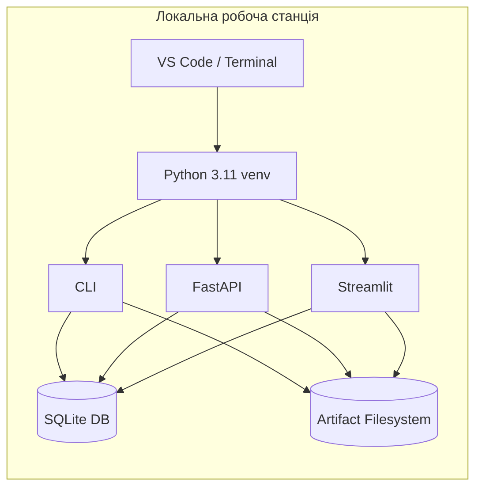

# DOC-07 Deployment Diagram

```mermaid
flowchart LR
    subgraph LocalWorkstation[Локальна робоча станція]
        IDE[VS Code / Terminal]
        VENV[Python 3.11 venv]
        CLI[CLI]
        API[FastAPI]
        UI[Streamlit]
        SQLITE[(SQLite DB)]
        FS[(Artifact Filesystem)]
    end

    IDE --> VENV
    VENV --> CLI
    VENV --> API
    VENV --> UI
    CLI --> SQLITE
    CLI --> FS
    API --> SQLITE
    API --> FS
    UI --> SQLITE
    UI --> FS
```

Фаза 11 фіксує локальне розгортання без зовнішнього DB-server і без обов'язкових зовнішніх сервісів.
